# Improving Haar Cascade Detection with Classical Image Refinement

**CPS843 — Introduction to Computer Vision · Final Project · Toronto Metropolitan University**

Can you make a 2001-era object detector work better without retraining it? This project says yes, and measures how much.

Haar cascades are still everywhere in embedded and real-time systems because they are fast and cheap. They are also fragile: intensity-based features mean lighting, contrast, noise, and pose changes wreck detection accuracy and flood the output with false positives. Instead of retraining or swapping in a CNN, this project applies classical preprocessing to the **input image only** and evaluates what each technique does to detection quality.

---

## Contents

- [The problem](#the-problem)
- [Techniques evaluated](#techniques-evaluated)
- [Experimental setup](#experimental-setup)
- [Results](#results)
- [Key findings](#key-findings)
- [Repository structure](#repository-structure)
- [Running it](#running-it)
- [References](#references)

---

## The problem

Haar cascades scan an image with a sliding window and evaluate Haar-like features at multiple scales, where each feature is a difference in pixel intensity between adjacent rectangular regions. A cascade of AdaBoost-trained weak classifiers rejects non-object regions quickly.

That design is what makes them fast, and also what makes them brittle. Every decision the cascade makes comes down to local intensity contrast, so any degradation in illumination or edge clarity directly corrupts feature response.

Here is the baseline, unprocessed, using stock OpenCV cascades for face, eyes, and smile:

<p align="center">
  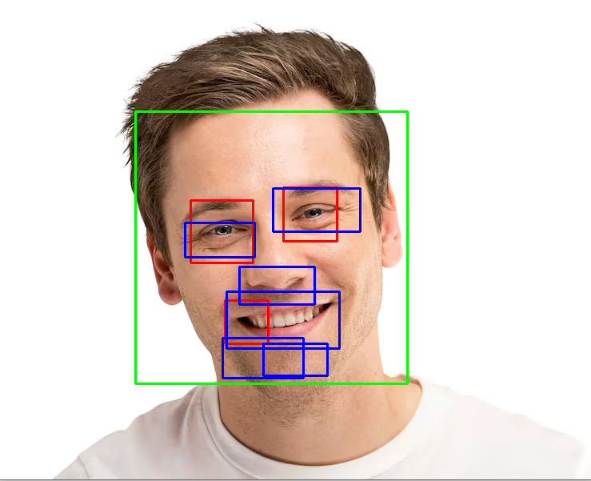
</p>

Face detection lands (green), but there are duplicate eye boxes and multiple false smile detections stacked across the lower face. The corresponding histogram shows why:

<p align="center">
  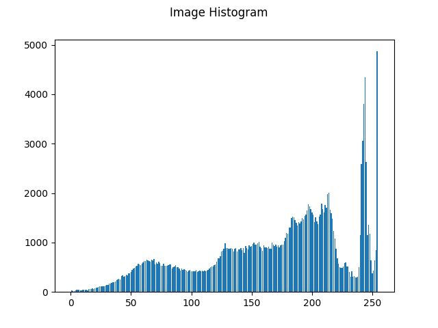
</p>

Most of the mass sits in the 200 to 255 range. The image is effectively overexposed, so contrast between key facial features is poorly defined and the cascade has weak signal to work with.

---

## Techniques evaluated

Each technique is applied **independently** to the input, then passed to the same untouched cascade models.

| Technique | What it does | Implementation |
|---|---|---|
| Histogram equalization | Redistributes intensities evenly across the range | Global equalization |
| Brightness adjustment | Shifts per-pixel intensity by a fixed offset | Pure point transform, no smoothing |
| Contrast refinement | Compresses or expands the intensity range | Log, inverse log, power-law (γ = 0.5, 1.2, 1.8, 2.5) |
| Edge exaggeration | Amplifies feature boundaries | Sobel (k = 0.5, 1.2, 1.5, 2) and highboost (σ = 0.5, 1.5, 3, 5) |
| Image reconstruction | Averages multiple aligned views into one normalized face | Detect, crop, eye-based similarity transform, stack |

---

## Experimental setup

**Dataset.** A single image was used consistently across every preprocessing experiment to keep the comparison controlled. It was deliberately chosen as a case with poor baseline feature recognition, so the effect of each transform is visible.

Image reconstruction is the outlier. It needs multiple views of the same subject, so a separate multi-angle set was captured manually on a laptop webcam. Non-ideal lighting, sensor noise, and real background clutter are features here, not bugs: they make the reconstruction test more representative of deployment conditions.

**Evaluation.** All experiments use the same pretrained cascades with identical parameters. Results are assessed on detection success, false positive count, and visual stability of detected regions, with the intensity histogram of each processed image used as a supporting diagnostic.

---

## Results

### Histogram equalization

The best performer overall. Eliminated all eye false positives and cut smile false positives substantially.

<p align="center">
  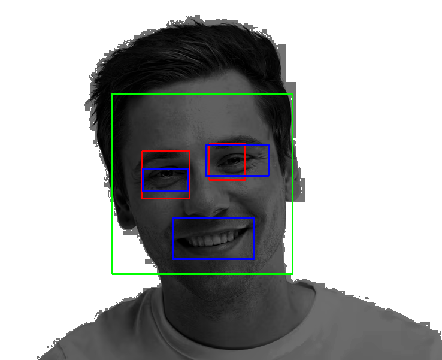
  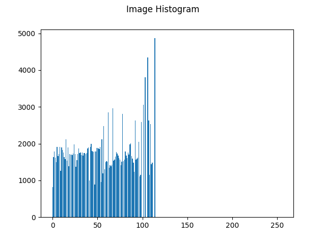
</p>

The resulting histogram is a fairly uniform spread across the 0 to 100 range. This is treated as the reference "best case" distribution for the rest of the experiments.

### Brightness adjustment

Shifting intensity by ±10 was inconclusive, with both directions producing plenty of false positives. Brightening had slightly fewer.

<p align="center">
  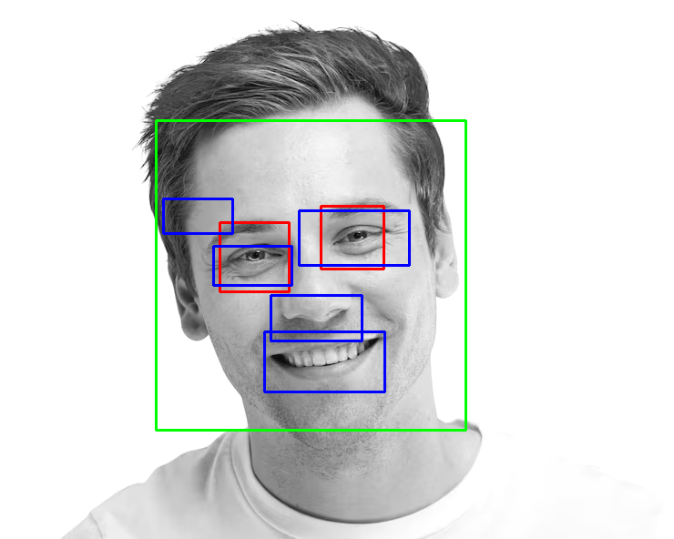
</p>

Pushing the shift to ±50 flipped the result. The **reduction** by 50 gave the best output of the brightness filter:

<p align="center">
  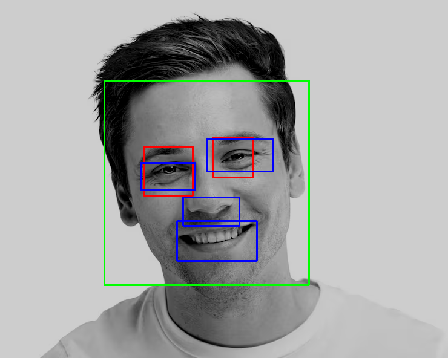
</p>

One anomaly worth flagging: the histogram for this case shows a very large spike at 255 that does not reflect the image actually produced. The cause was not identified and appears specific to this run of the histogram generation function. An equalized histogram was generated for the same image as a sanity check and behaved as expected.

<p align="center">
  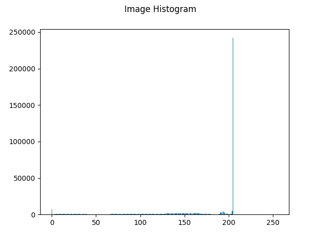
  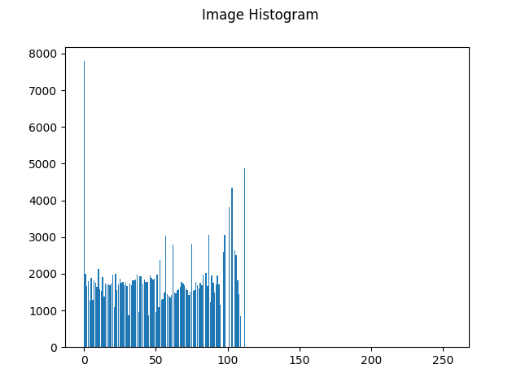
</p>

### Contrast refinement

Log, inverse log, and power-law transforms were paired by effect: log and power-law with γ < 1 both decrease contrast and raise intensity, while inverse log and power-law with γ > 1 do the reverse. Of the four gamma values tested, the best results came from the log transform, followed by power-law with γ = 0.5.

<p align="center">
  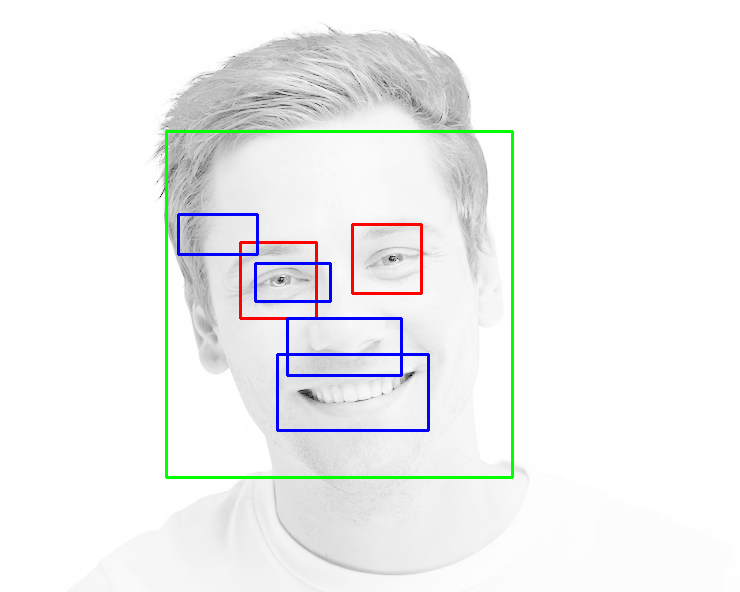
  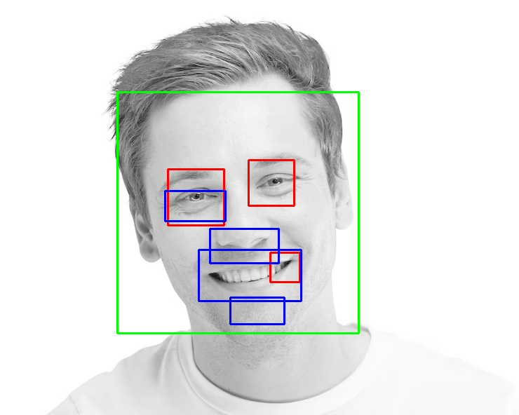
</p>

Neither is ideal, but both improve on the baseline false positive count. Histograms are consistent with the visual results:

<p align="center">
  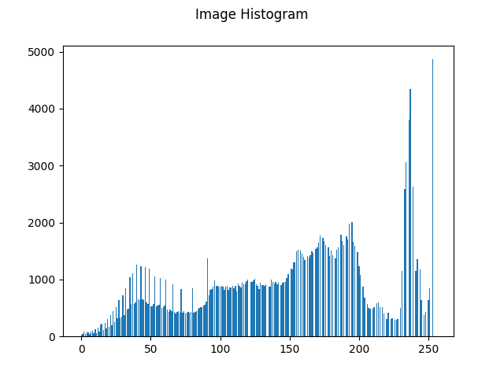
  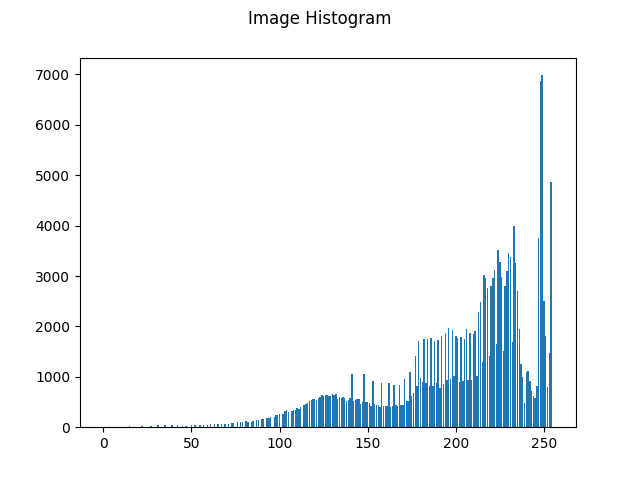
</p>

### Image reconstruction

The pipeline: detect and crop the largest face, resize to a fixed resolution to normalize scale, align to a reference frame using a similarity transform derived from eye geometry (rotation to match eye-line orientation, scaling to match inter-eye distance, translation to align eye midpoints), then average or median-stack the aligned crops. When eye detection fails, a face-only alignment fallback runs instead.

**Configuration 1** (`reconstruct_config1_face_only.m`) picks the reference frame as the first image with any detected face. Eye-based alignment is attempted per frame, with a face-only fallback when eye detection fails. This exposed a real failure mode: the reference frame itself can be a false positive.

<p align="center">
  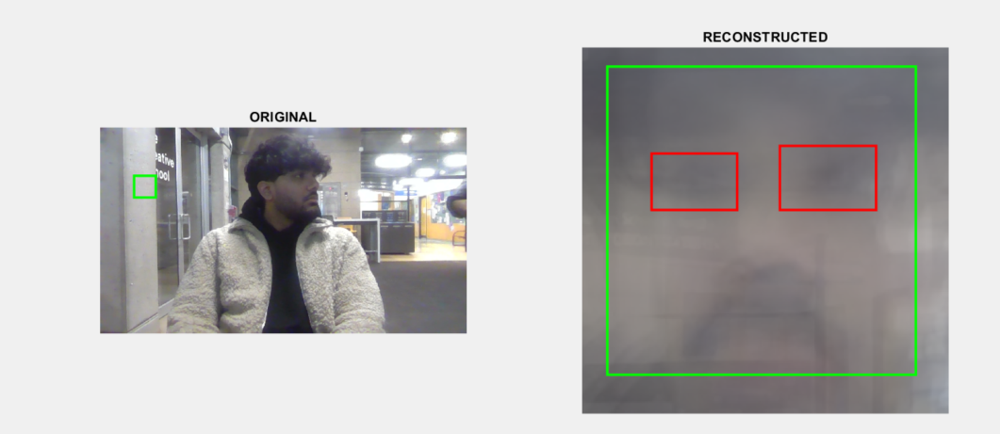
</p>

<p align="center">
  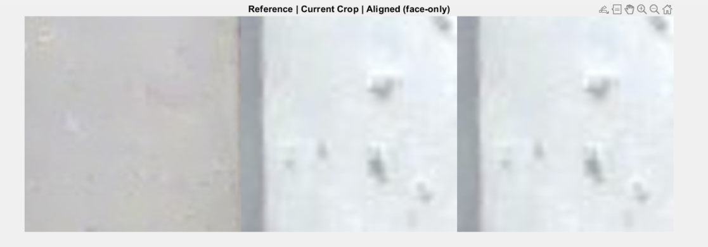
</p>

Even so, the reconstructed average face eliminates the background false positives that survive in single-frame detection.

**Configuration 2** (`reconstruct_config2_face_and_eyes.m`) constrains the reference frame to require both a face and a valid eye-pair, using the `EyePairBig` detector. (The original constraint also required a smile, but was relaxed since the subject was not smiling.) A frame with no detectable eye-pair is rejected outright rather than falling back, so only frames satisfying the constraint are stacked.

<p align="center">
  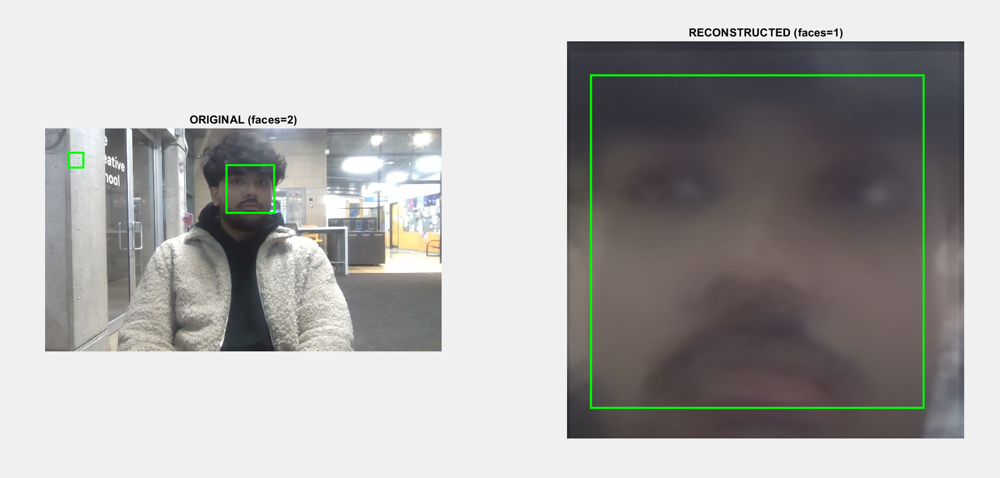
</p>

<p align="center">
  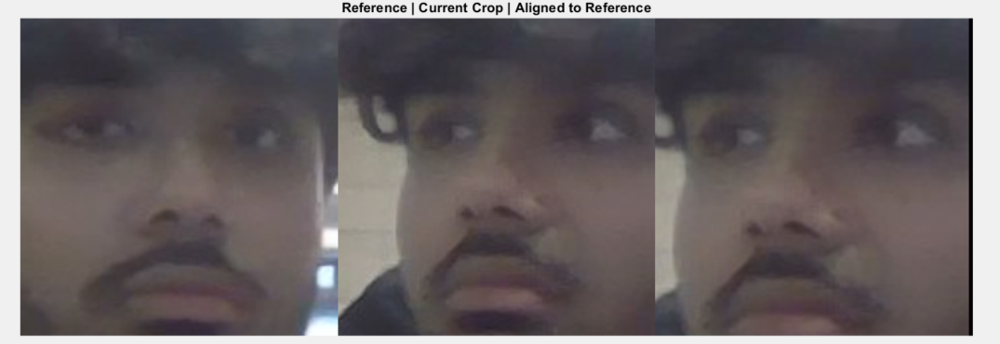
</p>

A false positive still appears on the reference frame, but the stricter gating meant the frame with the subject facing the camera was selected, and reconstruction and reference converge on the same result. Faces in the background remain an unsolved problem and can still poison reference selection.

Stacked outputs, 16 frames versus 7:

<p align="center">
  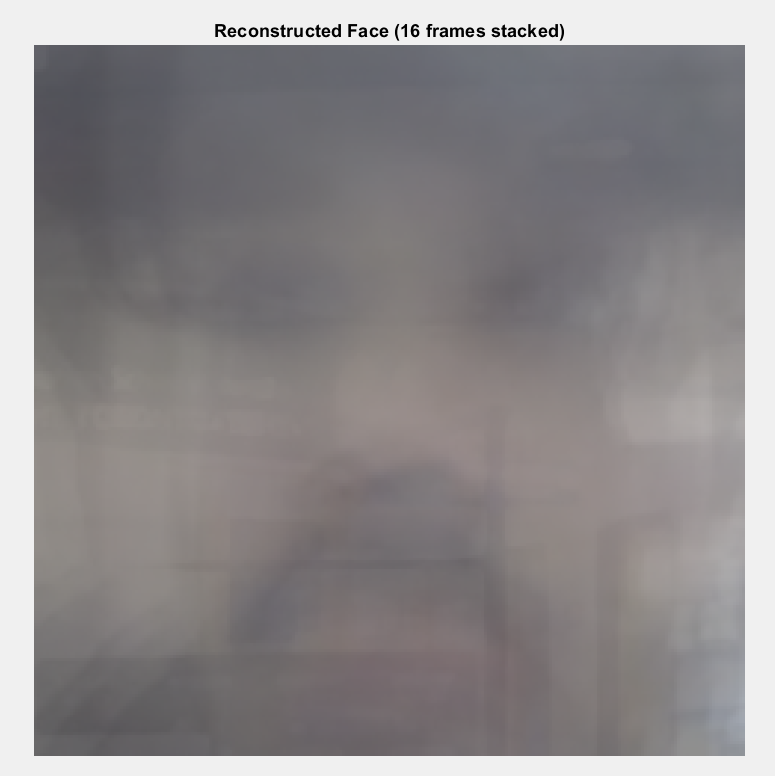
  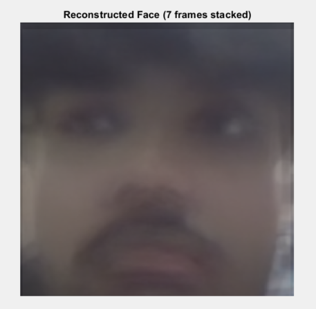
</p>

### Edge exaggeration

Sobel-detected edges were added back onto the original image to amplify feature boundaries, alongside a highboost filter. The theory: thicker edges give cleaner bounds around eyes and mouth. The risk: over-emphasis turns creases and skin texture into detectable structure. The best result across both filters was highboost with σ = 5.

<p align="center">
  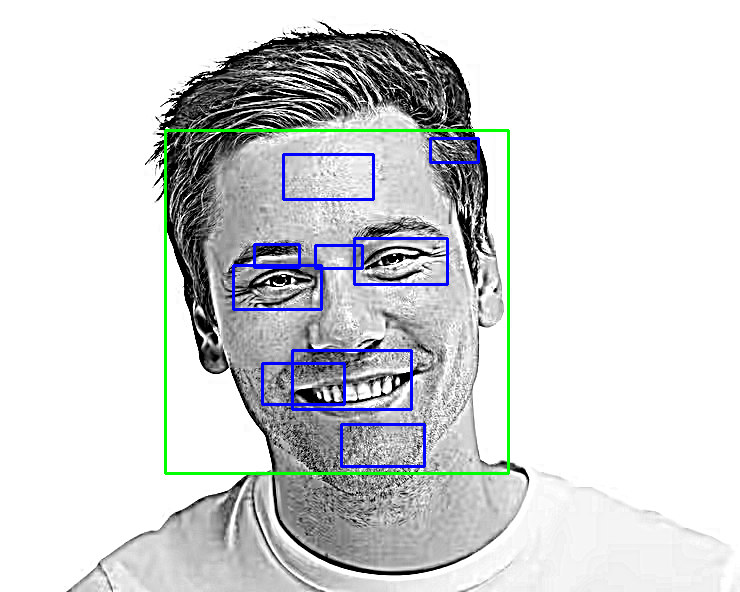
  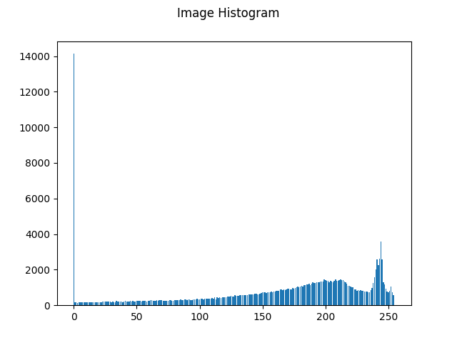
</p>

The histogram shows a large spike at 0 with the bulk of the distribution near 200. Contrast is not ideal on its own, which suggests edge exaggeration works better as a stage in a pipeline than as a standalone fix.

---

## Key findings

1. **Histogram distribution predicts detection quality.** A uniform spread of intensities across roughly 0 to 100 consistently produced the best detections. Concentration at either intensity extreme produced the worst.
2. **Histogram equalization is the single best standalone technique.** It removed eye false positives entirely and significantly reduced smile false positives.
3. **Multi-frame reconstruction kills background false positives** even under varying subject angle, but only if the reference frame is chosen carefully. Gating on face plus valid eye-pair is a cheap and effective fix.
4. **Periocular anatomy is a persistent failure mode.** Pronounced under-eye contours produce intensity patterns that resemble mouth-like Haar features, triggering mouth detections at the eye regions. No preprocessing technique tested fully removed this.
5. **Preprocessing is a real lever.** Meaningful accuracy gains are available without touching the model, which matters most in exactly the resource-constrained environments where Haar cascades are still used.

---

## Repository structure

```
.
├── haar_testbench.py           # runs the cascades and draws detections
├── histogram_equalization.py   # global equalization
├── histogram_extractor.py      # generates the intensity histograms
├── brightness.py               # per-pixel intensity offset
├── contrast.py                 # log, inverse log, power-law transforms
├── edge_exaggeration.py        # Sobel and highboost filters
│
├── cascades/                   # OpenCV Haar cascade XML files
├── assets/                     # figures used in this README
│
├── brightness/                 # output images, brightness adjustment
├── equalized/                  # output images, histogram equalization
├── log/                        # output images, log transform
├── inverselog/                 # output images, inverse log transform
├── powerlaw/                   # output images, power-law transform
├── histogram/                  # generated histograms
├── results/                    # detection results
│
└── reconstruction/             # MATLAB, multi-view face reconstruction
    ├── reconstruct_config1_face_only.m
    ├── reconstruct_config2_face_and_eyes.m
    └── faceViews/              # 20 webcam frames of the subject at varying angles
```

`smile_sample_1.png` and `smile_sample_1.tiff` in the root are the shared test image used across every experiment.

---

## Running it

**Requirements**

```
python 3.x
opencv-python
numpy
matplotlib
```

**Requirements**

The preprocessing filters are Python. The reconstruction pipeline is MATLAB.

```
python 3.x
opencv-python
numpy
matplotlib
```

```bash
pip install opencv-python numpy matplotlib
```

For reconstruction: MATLAB with the Image Processing Toolbox and the Computer Vision Toolbox. The cascade detectors used (`FrontalFaceCART`, `LeftEye`, `RightEye`, `EyePairBig`) are built into `vision.CascadeObjectDetector` and need no separate download.

The OpenCV cascade XML files used by the Python scripts are included in `cascades/`.

**Preprocessing filters**

```bash
# 1. Apply a filter to the test image
python histogram_equalization.py
python brightness.py
python contrast.py
python edge_exaggeration.py

# 2. Run the cascades over the processed output
python haar_testbench.py

# 3. Generate the intensity histogram for an image
python histogram_extractor.py
```

> Confirm these are the right invocations and add any arguments the scripts take (input path, gamma value, sigma, and so on).

**Reconstruction**

Open either script in MATLAB and run it. Both resolve `faceViews/` relative to the script location, so no path editing is needed.

| Setting | Default | Effect |
|---|---|---|
| `outSize` | `[240 240]` | Normalized face crop resolution |
| `useMedian` | `false` | `false` averages the stack, `true` takes the median |
| `showDebug` | `true` | Shows the reference, crop, and aligned montage per frame |

Each script prints the reference frame it selected and the number of frames stacked, then displays a side-by-side of detections on the original versus the reconstruction.

---

## References

1. P. Viola and M. Jones, "Rapid Object Detection using a Boosted Cascade of Simple Features," *Proceedings of the IEEE Conference on Computer Vision and Pattern Recognition*, 2001.
2. R. C. Gonzalez and R. E. Woods, *Digital Image Processing*, Pearson, 4th ed.
3. A. Rosebrock, "OpenCV Haar Cascades," *PyImageSearch*, Apr. 12, 2021. https://pyimagesearch.com/2021/04/12/opencv-haar-cascades/
4. OpenCV pretrained cascades. https://github.com/opencv/opencv/tree/master/data/haarcascades
